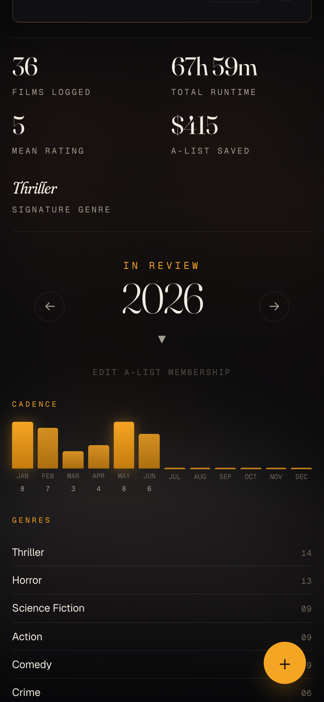
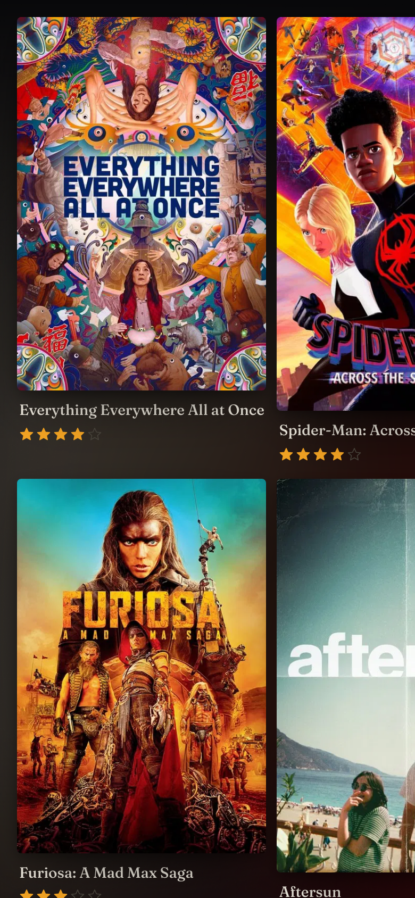
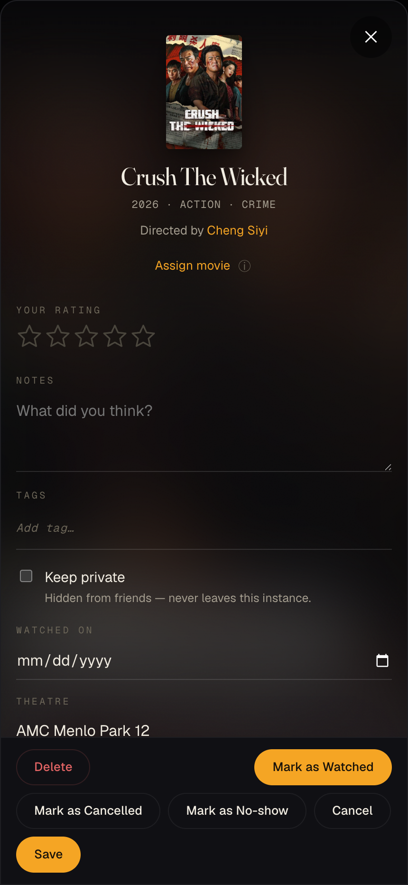
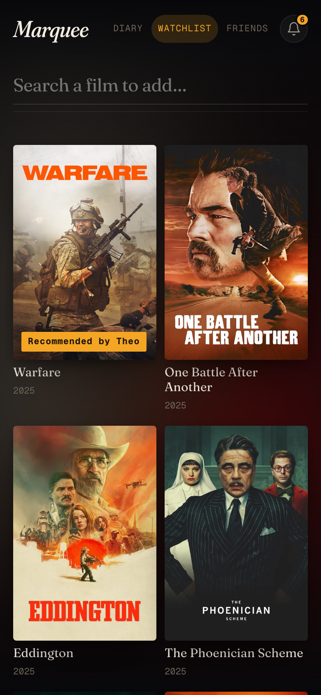
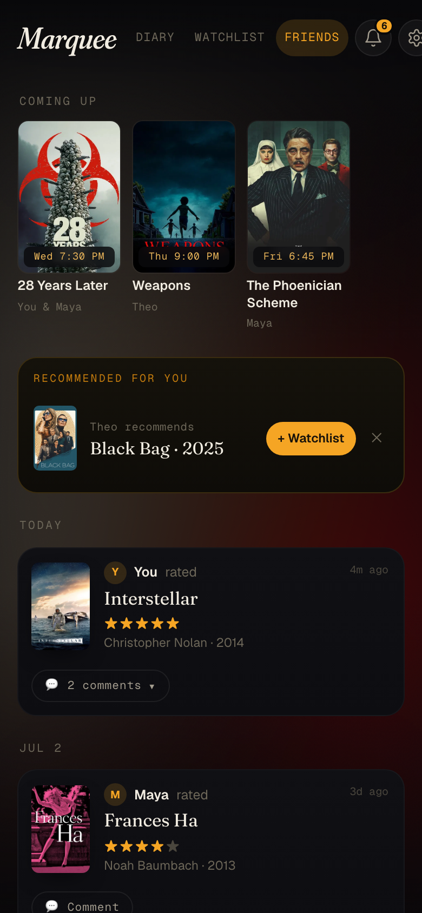
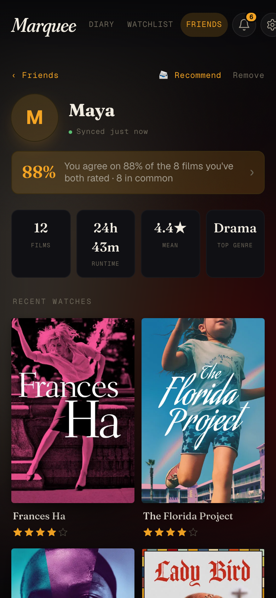
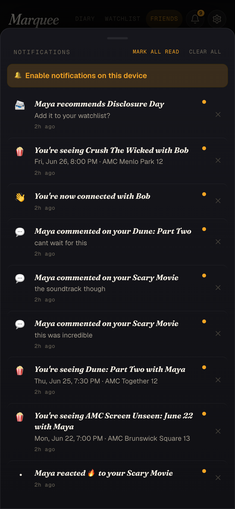
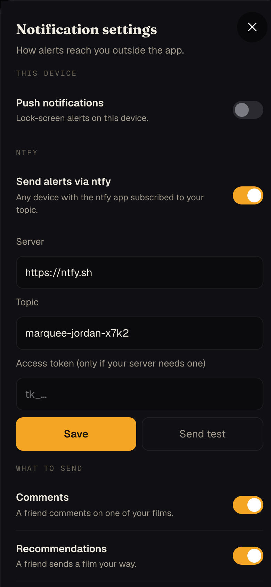
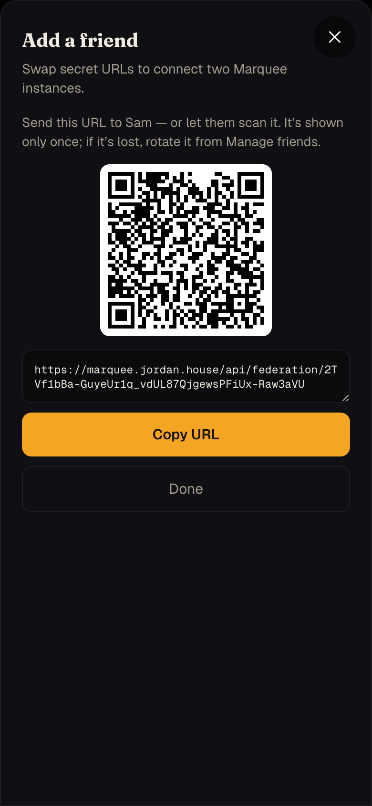

# Marquee

A self-hosted AMC movie tracker. Marquee watches your Gmail for AMC reservation and
"Thank You" emails, parses them, enriches each film with TMDB metadata, and surfaces
your whole moviegoing history in a cinematic poster-grid PWA — plus an optional
federated **Friends** layer that lets you connect with other Marquee instances and
share what you're watching.

<table>
  <tr>
    <td align="center"><br><sub><b>Year-in-Review</b></sub></td>
    <td align="center"><br><sub><b>Poster grid</b></sub></td>
    <td align="center"><br><sub><b>Film detail</b></sub></td>
  </tr>
  <tr>
    <td align="center"><br><sub><b>Watchlist</b></sub></td>
    <td align="center"><br><sub><b>Friends feed</b></sub></td>
    <td align="center"><br><sub><b>Friend profile</b></sub></td>
  </tr>
  <tr>
    <td align="center"><br><sub><b>Notifications</b></sub></td>
    <td align="center"><br><sub><b>ntfy &amp; push settings</b></sub></td>
    <td align="center"><br><sub><b>Add a friend</b></sub></td>
  </tr>
</table>

## Features

**Your diary**
- **Automatic logging** — reads your AMC emails and records every movie, no manual entry.
- **Rich metadata** — pulls posters, runtimes, genres, and directors from TMDB.
- **Screen Unseen reveals** — resolves AMC Screen/Scream Unseen mysteries via r/AMCsAList, keeping the title hidden until the showing lets out.
- **Showtimes on posters** — upcoming films show their release date; booked reservations show the showtime.
- **Year-in-Review** — cadence chart, top genres/directors/theatres, 5★ picks, and a per-month/per-year A-List savings breakdown. Every stat is tappable for a plain-English detail sheet.
- **Search & filter** — across your entire history by title, director, genre, rating, or format.
- **Installable PWA** — works on phone and desktop, offline-friendly.

**Friends (federation)**
- **Connect instances directly** — no central server; you and a friend swap secret URLs and the two instances sync over HTTP. Each URL is its own credential: revoke or rotate one friend without touching the rest.
- **Activity feed** — see what friends have logged and what's coming up.
- **Seeing together** — matching upcoming reservations merge into one card with a shared comment thread.
- **Recommend films** — push a film to a friend's watchlist with a "Recommended by you" badge.
- **Taste-match** — % agreement and films-in-common on each friend's profile.
- **Notifications** — in-app bell plus iOS Web Push and [ntfy](https://ntfy.sh) for recommendations, comments, and seeing-together alerts.

**Operations**
- **Daily backups** — automatic Postgres dumps, retained for 30 days.
- **Owner lock** — an optional passcode gates your diary so only the friend-facing API is reachable when you share the instance.

## Setup

Marquee runs as a single Docker stack (app + Postgres). You need Docker and two free
third-party credentials.

### 1. Get a TMDB API key (required)

1. Create an account at <https://www.themoviedb.org>.
2. Go to **Settings → API → Request an API key → Developer**.
3. Fill out the form (any URL works, e.g. `http://localhost:3000`). Approval is instant.
4. Copy the **v3 API key** (32 characters).

### 2. Get a Gmail app password (required for auto-ingest)

The poller signs into Gmail over IMAP and needs an app-specific password — not your
normal account password.

1. Enable **2-Step Verification** at <https://myaccount.google.com/security>.
2. Generate a password at <https://myaccount.google.com/apppasswords> (any name).
   Copy the **16-character** string.
3. Nothing else to configure — Marquee scans `[Gmail]/All Mail` for
   `from:@amctheatres.com` automatically.

> Skip this step to run in manual-entry-only mode: leave `GMAIL_USER` and
> `GMAIL_APP_PASSWORD` blank.

### 3. Launch

Marquee is published as a multi-architecture image (`linux/amd64` and
`linux/arm64`), so all you need are two files:

```bash
mkdir marquee && cd marquee
curl -O https://raw.githubusercontent.com/ijoshi129/Marquee/main/compose.yaml
curl -o .env https://raw.githubusercontent.com/ijoshi129/Marquee/main/.env.example
# Edit .env and fill in the Required variables (see Configuration below).
docker compose up -d
```

Open **<http://localhost:3000>**. If port 3000 is taken, set `APP_HOST_PORT` in
`.env` before launching.

`compose.yaml` tracks `:latest` by default. To pin a release, set `MARQUEE_TAG=2.2`
in `.env`.

<details>
<summary>Building from source instead</summary>

```bash
git clone https://github.com/ijoshi129/Marquee.git marquee && cd marquee
cp .env.example .env
docker compose -f compose.yaml -f compose.build.yaml up -d --build
```

</details>

### What to expect on first launch

The first poll fetches **every** AMC email in your inbox in one pass — with years of
history this can take a few minutes. After that, polls run every 5 minutes and only
look at new mail. Posters fade in as TMDB matches resolve. Reservations older than 30
days with no thank-you auto-flip to `watched`; anything 7–30 days old appears in the
bulletin asking "did you go or miss it?".

## Friends (federation) — optional

Connect your instance with a friend's so you can see each other's activity.
Connecting is a URL swap: adding a friend mints a secret URL for them, they do
the same for you, and you each paste the other's. The URL is the whole
credential — no accounts, no invite codes.

### 1. Make your instance reachable & locked

In `.env`, set:

```ini
FEDERATION_ENABLED=1
FEDERATION_BASE_URL=https://your-instance.example.com   # how friends reach you
INSTANCE_NAME=Your Name                                 # shown to friends
OWNER_PASSCODE=<long random string>                     # protects your diary
```

`FEDERATION_BASE_URL` is what your friend URLs are built from, so it must be
reachable from your friends' instances. Any of these works:

- **Cloudflare Tunnel (recommended — no open ports, hides your home IP).** Needs a
  domain on Cloudflare. In Zero Trust → Networks → Tunnels, create a tunnel and run
  the install command it gives you on the box running Marquee. Add one public
  hostname: e.g. `fed.your-domain.com`, **path** `api/federation/*`, service
  `http://localhost:3000` (your Marquee port). Set
  `FEDERATION_BASE_URL=https://fed.your-domain.com`. The path filter means nothing
  but the friend-facing API is ever reachable from the internet — everything else
  404s at Cloudflare's edge.
- **Reverse proxy + port forward** — any HTTPS proxy (Caddy, NPM, …) in front of
  the Marquee port; restrict it to `/api/federation/` if it supports path rules.
- **Same network / VPN** — if you and your friend already share a LAN or VPN, a
  plain `http://<ip>:<port>` address works; no public exposure needed.

Either way, only `/api/federation/*` needs to be reachable by friends; it answers
only to a valid secret URL and 404s everything else. `OWNER_PASSCODE` gates
**every** screen except that friend-facing API, so exposing the instance never
exposes your diary. You unlock once per device. Recreate the stack after editing
`.env` (`docker compose up -d`).

### 2. Connect

1. Open the **Friends** tab → **Add a friend**, enter their name — you get a
   secret URL to send them (shown once).
2. They do the same on their instance and send you their URL.
3. Paste each other's URLs (in **Add a friend**, or later via **Manage
   friends → Add URL**).

Once connected, each side syncs the other every few minutes (and within ~2–3s on
changes). Remove or rotate a friend's URL any time from **Manage friends**;
control what you expose under **What friends see**.

Treat these URLs like passwords: anyone holding yours can read what you share and
post comments as that friend. Send them over something private, and rotate a URL
if it leaks.

### 3. (Optional) iOS Web Push

To receive push notifications on an installed iOS PWA, generate VAPID keys and add them
to `.env`:

```bash
node -e "console.log(require('web-push').generateVAPIDKeys())"
```

```ini
VAPID_PUBLIC_KEY=...
VAPID_PRIVATE_KEY=...
VAPID_SUBJECT=mailto:you@example.com
```

Push requires HTTPS, an installed (Add to Home Screen) PWA, and iOS 16.4+. Without VAPID
keys the in-app notification bell still works.

### 4. (Optional) ntfy

Prefer ntfy (or can't use iOS push)? Open the bell → **ntfy alerts**, point it at
ntfy.sh or your own server with a topic of your choice, and pick which alerts to
send. Configured entirely in the UI — no env vars, works on any device with the
ntfy app subscribed to that topic. Use a hard-to-guess topic name; on ntfy.sh,
the topic is the only secret.

## Updating

```bash
cd marquee
docker compose pull
docker compose up -d
```

Your data volume (`marquee_pgdata`) is preserved across updates and new schema
migrations apply automatically on boot.

If you build from source, pull the repo and rebuild instead:

```bash
git pull
docker compose -f compose.yaml -f compose.build.yaml up -d --build
```

## Configuration

All settings live in `.env` at the repo root (every field is documented inline in
`.env.example`).

### Required

| Variable | Purpose |
|---|---|
| `POSTGRES_PASSWORD` | Password for the bundled Postgres. The connection URL is built from this automatically. |
| `TMDB_API_KEY` | Your v3 API key from themoviedb.org. |
| `GMAIL_USER` / `GMAIL_APP_PASSWORD` | Gmail address and app password. Leave both blank for manual-entry-only. |
| `BACKUP_HOST_PATH` | Host directory for daily backups. Point at durable storage so dumps survive container deletes. |

### Optional

| Variable | Default | Purpose |
|---|---|---|
| `APP_HOST_PORT` | `3000` | Host port the app listens on. |
| `POSTGRES_HOST_PORT` | `5433` | Host port for the bundled Postgres. |
| `BACKUP_RETENTION_DAYS` | `30` | How many days of backups to keep. |
| `ADMIN_API_TOKEN` | unset | Bearer token for the database export/import API. Strongly recommended if reachable beyond localhost. |
| `DATABASE_IMPORT_LIMIT` | `200mb` | Max request body size for the database import API. |
| `OWNER_PASSCODE` | unset | Passcode gating everything except the federation API. **Required before sharing your instance.** |
| `FEDERATION_ENABLED` | unset | Set to `1` to enable the Friends layer. |
| `FEDERATION_BASE_URL` | unset | This instance's externally-reachable URL; required to invite/accept friends. |
| `INSTANCE_NAME` | `Marquee` | The name friends see for your instance. |
| `FEDERATION_SYNC_INTERVAL_MIN` | `15` | How often to poll friends (change pushes are near-instant regardless). |
| `VAPID_PUBLIC_KEY` / `VAPID_PRIVATE_KEY` / `VAPID_SUBJECT` | unset | Web Push (iOS) credentials. |
| `TRAKT_CLIENT_ID` / `TRAKT_CLIENT_SECRET` / `TRAKT_REDIRECT_URI` | unset | Trakt app credentials (see below). |
| `TRAKT_ACCESS_TOKEN` / `TRAKT_REFRESH_TOKEN` | unset | Trakt user tokens, generated by the auth script. |

## Backups & restore

Daily gzipped dumps are written to `BACKUP_HOST_PATH`. To restore one:

```bash
gunzip < backups/marquee-2026-01-15.sql.gz \
  | docker exec -i marquee-postgres psql -U marqueeadmin marquee
```

You can also export/restore over the local API:

```bash
# Export a restorable gzipped SQL dump
curl -fsS http://127.0.0.1:3000/api/admin/database/export -o marquee-db.sql.gz
#   add -H "Authorization: Bearer $ADMIN_API_TOKEN" if that token is set

# Restore (replaces current DB contents)
curl -fsS -X POST http://127.0.0.1:3000/api/admin/database/import \
  -H 'Content-Type: application/gzip' --data-binary @marquee-db.sql.gz
```

## Screen Unseen reveals

AMC sells Screen Unseen and Scream Unseen screenings without saying what the film
is, and the reservation email is no more forthcoming — so those watches arrive with
no poster and no TMDB match. The community posts the answers in a megathread on
[r/AMCsAList](https://www.reddit.com/r/AMCsAList/), which Marquee reads to fill them
in once the reveal is up. Nothing to configure: it reads the subreddit's public Atom
feed, no Reddit account or API key involved.

The reveal usually isn't posted until after the screening, so a fresh Unseen stays
unidentified for a while — that's expected. The film sheet has a **Re-check** button
to force a fresh lookup when the megathread has been updated but the app hasn't
noticed yet, and **Assign movie** to set it yourself. You were there, after all.

## Trakt sync (optional)

To mirror watches to Trakt, create an app at
<https://trakt.tv/oauth/applications>. Add every URL where you access Marquee to the
app's **Redirect URI** and **JavaScript origin** fields (e.g. `http://localhost:3000`
locally, plus any public URL behind a reverse proxy). Put the client ID, secret, and
chosen redirect URI in `.env`, then authorize:

```bash
node server/scripts/trakt-device-auth.js   # approve in a browser; tokens saved to .env
node server/scripts/trakt-backfill.js      # queue previously-logged movies (optional)
```

## Troubleshooting

| Symptom | Fix |
|---|---|
| Empty grid + "Stats failed" after a few minutes | Server can't reach Postgres. Check `docker logs marquee` for `Postgres connected`. On `ECONNREFUSED`, confirm `POSTGRES_PASSWORD` matches the running container. |
| Poller logs `imap: 0 messages` | No matching AMC emails, or IMAP is blocked. Run `node server/scripts/imap-debug.js` to verify the connection. |
| `Invalid credentials` from Gmail | You're using your account password, not an app-specific one — see step 2. |
| TMDB matches wrong/missing | Open the watch → **Assign movie** → pick the right film. Bulk re-run: `node server/scripts/backfill-tmdb.js`. |
| Friend won't sync / shows an error | Confirm both sides have `FEDERATION_ENABLED=1` and that each pasted URL is reachable from the other box. "Access rejected" means their URL for you was rotated or removed — ask for a fresh one and paste it via **Manage friends → Edit URL**. |
| iOS push silent or missing | Needs HTTPS, an installed PWA, iOS 16.4+, and VAPID keys set. Remove and re-add the home-screen icon to refresh the service worker. |
| Blank/white splash on iOS | iOS caches the splash at install. Remove the home-screen icon, force-quit Safari, reopen the site, re-Add to Home Screen. |
| Backups missing from `BACKUP_HOST_PATH` | Confirm `BACKUP_DIR` is set (default `/backups`) and the host path is writable. Manual run: `docker exec marquee node -e "require('./workers/backup').runBackup().then(p => console.log(p))"`. |

## Reference

<details>
<summary><b>API routes</b></summary>

**Diary**

| Route | Purpose |
|---|---|
| `GET /api/health` | Liveness check; pings the database. |
| `GET /api/watches` | List watches. Supports `q`, `status`, `sort`, `dir`, `genre`, `min_rating`, `format`, `from`, `to`, `limit`, `offset`. |
| `GET /api/watches/notifications` | Watches needing attention (no-show, cancelled, identify, confirm). |
| `GET /api/watches/:id` · `POST /api/watches` · `PATCH /api/watches/:id` · `DELETE /api/watches/:id` | Read/create/update/delete a watch. |
| `POST /api/watches/:id/recheck-unseen` | Re-resolve a Screen Unseen against r/AMCsAList. |
| `GET /api/tmdb/search?q=` · `GET /api/theaters?q=` · `GET /api/search-suggest?q=` | Search helpers. |
| `GET /api/stats?period=all\|year\|month&month=YYYY-MM` | Aggregate stats; drives Year-in-Review. |
| `GET /api/export[?download=0]` | Full JSON dump of watches, theatres, and TMDB cache. |
| `GET /api/admin/database/export` · `POST /api/admin/database/import` | Full DB backup / restore (import is destructive). |

**Friends & social**

| Route | Purpose |
|---|---|
| `GET\|POST /api/friends` · `PATCH\|DELETE /api/friends/:id` | List / add / edit / remove friends. |
| `POST /api/friends/:id/rotate` | Mint a fresh secret URL for a friend. |
| `GET /api/friends/feed` | Combined activity feed. |
| `GET /api/friends/:id/watches` · `GET /api/friends/:id/profile` · `GET /api/friends/:id/common` | A friend's cached diary, profile, and films-in-common. |
| `POST /api/friends/:id/comment` · `POST /api/friends/:id/recommend` | Comment on / recommend a film. |
| `GET\|PUT /api/friends/settings` | What you share. |
| `GET\|POST\|DELETE /api/notifications` | In-app notifications (list, mark read, dismiss/clear). |
| `/api/federation/:token/*` | Friend-facing; the secret URL is the credential. Fails closed unless `FEDERATION_ENABLED=1`. |

All `/api/*` routes are rate-limited to 600 req/min per IP. With `OWNER_PASSCODE` set,
every route except `/api/federation`, `/api/auth`, and `/api/health` requires the
unlock header.

</details>

<details>
<summary><b>Database schema</b></summary>

Auto-applied on boot via `CREATE TABLE IF NOT EXISTS` in `server/db.js` plus numbered
migrations under `server/migrations/`.

- `theaters` — distinct AMC venues seen so far.
- `watches` — one row per reservation/Thank You. `status` is `pending`, `watched`, `cancelled`, or `no_show`.
- `tmdb_cache` — TMDB API responses, keyed by `tmdb_id`.
- `email_log` — every parsed AMC email, deduped by `gmail_message_id`; pruned to the last 730 days.
- `friends` / `friend_watches` / `friend_profiles` — connected instances and their cached diaries.
- `social_events` / `notifications` — comments, recommendations, and the notification feed.
- `_migrations` — tracks which numbered SQL files have been applied.

</details>

## Stack

React 18 + Vite (plain JS/CSS) · Node 20 + Express · Postgres 16 · `imapflow` +
`cheerio` for email ingest · `web-push` for iOS notifications · single multi-stage
Docker image bundled with Postgres via `compose.yaml`.
